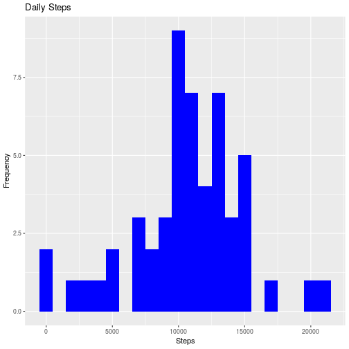
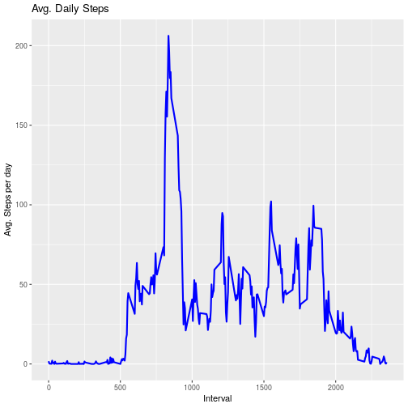
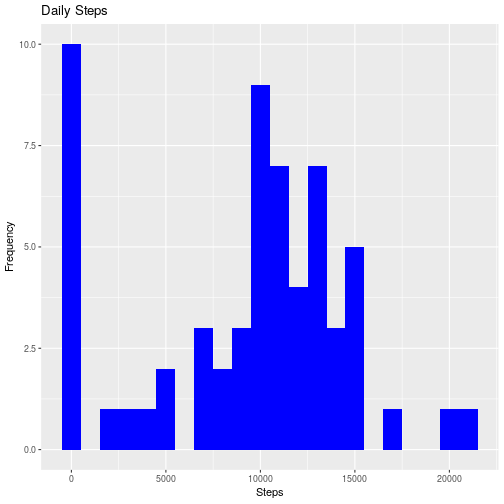
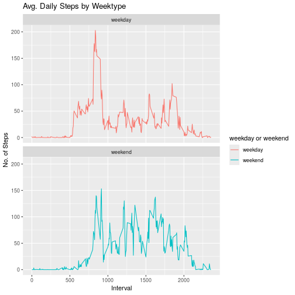

## Introduction

It is now possible to collect a large amount of data about personal
movement using activity monitoring devices such as a
[Fitbit](http://www.fitbit.com), [Nike
Fuelband](http://www.nike.com/us/en_us/c/nikeplus-fuelband), or
[Jawbone Up](https://jawbone.com/up). These type of devices are part of
the "quantified self" movement -- a group of enthusiasts who take
measurements about themselves regularly to improve their health, to
find patterns in their behavior, or because they are tech geeks. But
these data remain under-utilized both because the raw data are hard to
obtain and there is a lack of statistical methods and software for
processing and interpreting the data.

This assignment makes use of data from a personal activity monitoring
device. This device collects data at 5 minute intervals through out the
day. The data consists of two months of data from an anonymous
individual collected during the months of October and November, 2012
and include the number of steps taken in 5 minute intervals each day.

## Loading and preprocessing the data
Unzip data to obtain a csv file.


``` r
library("data.table")
```

```
## Registered S3 method overwritten by 'data.table':
##   method           from
##   print.data.table
```

```
## data.table 1.15.4 using 2 threads (see ?getDTthreads).  Latest news: r-datatable.com
```

``` r
library(ggplot2)

fileUrl <- "https://d396qusza40orc.cloudfront.net/repdata%2Fdata%2Factivity.zip"
download.file(fileUrl, destfile = paste0(getwd(), '/repdata%2Fdata%2Factivity.zip'), method = "curl")
unzip("repdata%2Fdata%2Factivity.zip",exdir = "data")
```

## Reading csv Data into Data.Table. 

``` r
activityDT <- data.table::fread(input = "data/activity.csv")
```

## What is mean total number of steps taken per day?

1. Calculate the total number of steps taken per day


``` r
Total_Steps <- activityDT[, c(lapply(.SD, sum, na.rm = FALSE)), .SDcols = c("steps"), by = .(date)] 

head(Total_Steps, 10)
```

2. If you do not understand the difference between a histogram and a barplot, research the difference between them. Make a histogram of the total number of steps taken each day. 


``` r
ggplot(Total_Steps, aes(x = steps)) +
    geom_histogram(fill = "blue", binwidth = 1000) +
    labs(title = "Daily Steps", x = "Steps", y = "Frequency")
```

```
## Warning: Removed 8 rows containing non-finite outside the scale range (`stat_bin()`).
```



3. Calculate and report the mean and median of the total number of steps taken per day

``` r
Total_Steps[, .(Mean_Steps = mean(steps, na.rm = TRUE), Median_Steps = median(steps, na.rm = TRUE))]
```

## What is the average daily activity pattern?

1. Make a time series plot (i.e. 𝚝𝚢𝚙𝚎 = "𝚕") of the 5-minute interval (x-axis) and the average number of steps taken, averaged across all days (y-axis)


``` r
IntervalDT <- activityDT[, c(lapply(.SD, mean, na.rm = TRUE)), .SDcols = c("steps"), by = .(interval)] 

ggplot(IntervalDT, aes(x = interval , y = steps)) + geom_line(color="blue", size=1) + labs(title = "Avg. Daily Steps", x = "Interval", y = "Avg. Steps per day")
```

```
## Warning: Using `size` aesthetic for lines was deprecated in ggplot2 3.4.0.
## ℹ Please use `linewidth` instead.
## This warning is displayed once every 8 hours.
## Call `lifecycle::last_lifecycle_warnings()` to see where this warning was generated.
```



2. Which 5-minute interval, on average across all the days in the dataset, contains the maximum number of steps?


``` r
IntervalDT[steps == max(steps), .(max_interval = interval)]
```

## Imputing missing values


1. Calculate and report the total number of missing values in the dataset (i.e. the total number of rows with 𝙽𝙰s)


``` r
activityDT[is.na(steps), .N ]
```

```
## [1] 2304
```

``` r
# alternative solution
nrow(activityDT[is.na(steps),])
```

```
## [1] 2304
```

2. Devise a strategy for filling in all of the missing values in the dataset. The strategy does not need to be sophisticated. For example, you could use the mean/median for that day, or the mean for that 5-minute interval, etc.


``` r
# Filling in missing values with median of dataset. 
activityDT[is.na(steps), "steps"] <- activityDT[, c(lapply(.SD, median, na.rm = TRUE)), .SDcols = c("steps")]
```

3. Create a new dataset that is equal to the original dataset but with the missing data filled in.


``` r
data.table::fwrite(x = activityDT, file = "data/tidyData.csv", quote = FALSE)
```

4. Make a histogram of the total number of steps taken each day and calculate and report the mean and median total number of steps taken per day. Do these values differ from the estimates from the first part of the assignment? What is the impact of imputing missing data on the estimates of the total daily number of steps?


``` r
# total number of steps taken per day
Total_Steps <- activityDT[, c(lapply(.SD, sum)), .SDcols = c("steps"), by = .(date)] 

# mean and median total number of steps taken per day
Total_Steps[, .(Mean_Steps = mean(steps), Median_Steps = median(steps))]

ggplot(Total_Steps, aes(x = steps)) + geom_histogram(fill = "blue", binwidth = 1000) + labs(title = "Daily Steps", x = "Steps", y = "Frequency")
```



Type of Estimate | Mean_Steps | Median_Steps
--- | --- | ---
First Part (with na) | 10765 | 10765
Second Part (fillin in na with median) | 9354.23 | 10395

## Are there differences in activity patterns between weekdays and weekends?


1. Create a new factor variable in the dataset with two levels – “weekday” and “weekend” indicating whether a given date is a weekday or weekend day.


``` r
# Just recreating activityDT from scratch then making the new factor variable. (No need to, just want to be clear on what the entire process is.) 
activityDT <- data.table::fread(input = "data/activity.csv")
activityDT[, date := as.POSIXct(date, format = "%Y-%m-%d")]
activityDT[, `Day of Week`:= weekdays(x = date)]
activityDT[grepl(pattern = "Monday|Tuesday|Wednesday|Thursday|Friday", x = `Day of Week`), "weekday or weekend"] <- "weekday"
activityDT[grepl(pattern = "Saturday|Sunday", x = `Day of Week`), "weekday or weekend"] <- "weekend"
activityDT[, `weekday or weekend` := as.factor(`weekday or weekend`)]
head(activityDT, 10)
```

2. Make a panel plot containing a time series plot (i.e. 𝚝𝚢𝚙𝚎 = "𝚕") of the 5-minute interval (x-axis) and the average number of steps taken, averaged across all weekday days or weekend days (y-axis). See the README file in the GitHub repository to see an example of what this plot should look like using simulated data.


``` r
activityDT[is.na(steps), "steps"] <- activityDT[, c(lapply(.SD, median, na.rm = TRUE)), .SDcols = c("steps")]
IntervalDT <- activityDT[, c(lapply(.SD, mean, na.rm = TRUE)), .SDcols = c("steps"), by = .(interval, `weekday or weekend`)] 

ggplot(IntervalDT , aes(x = interval , y = steps, color=`weekday or weekend`)) + geom_line() + labs(title = "Avg. Daily Steps by Weektype", x = "Interval", y = "No. of Steps") + facet_wrap(~`weekday or weekend` , ncol = 1, nrow=2)
```



``` r
library(knitr)
library(markdown)
knit2html("PA1_template.Rmd")
```

```
## Warning: It seems you should call rmarkdown::render() instead of knitr::knit2html() because PA1_template.Rmd appears to be
## an R Markdown v2 document.
```

```
## 
## 
## processing file: PA1_template.Rmd
```

```
## 
  |                                                                                                    
  |                                                                                              |   0%
  |                                                                                                    
  |...                                                                                           |   4%                   
  |                                                                                                    
  |.......                                                                                       |   7% [unnamed-chunk-32]
  |                                                                                                    
  |..........                                                                                    |  11%                   
  |                                                                                                    
  |..............                                                                                |  15% [unnamed-chunk-33]
  |                                                                                                    
  |.................                                                                             |  19%                   
  |                                                                                                    
  |.....................                                                                         |  22% [unnamed-chunk-34]
  |                                                                                                    
  |........................                                                                      |  26%                   
  |                                                                                                    
  |............................                                                                  |  30% [unnamed-chunk-35]
  |                                                                                                    
  |...............................                                                               |  33%                   
  |                                                                                                    
  |...................................                                                           |  37% [unnamed-chunk-36]
  |                                                                                                    
  |......................................                                                        |  41%                   
  |                                                                                                    
  |..........................................                                                    |  44% [unnamed-chunk-37]
  |                                                                                                    
  |.............................................                                                 |  48%                   
  |                                                                                                    
  |.................................................                                             |  52% [unnamed-chunk-38]
  |                                                                                                    
  |....................................................                                          |  56%                   
  |                                                                                                    
  |........................................................                                      |  59% [unnamed-chunk-39]
  |                                                                                                    
  |...........................................................                                   |  63%                   
  |                                                                                                    
  |...............................................................                               |  67% [unnamed-chunk-40]
  |                                                                                                    
  |..................................................................                            |  70%                   
  |                                                                                                    
  |......................................................................                        |  74% [unnamed-chunk-41]
  |                                                                                                    
  |.........................................................................                     |  78%                   
  |                                                                                                    
  |.............................................................................                 |  81% [unnamed-chunk-42]
  |                                                                                                    
  |................................................................................              |  85%                   
  |                                                                                                    
  |....................................................................................          |  89% [unnamed-chunk-43]
  |                                                                                                    
  |.......................................................................................       |  93%                   
  |                                                                                                    
  |...........................................................................................   |  96% [unnamed-chunk-44]
  |                                                                                                    
  |..............................................................................................| 100% [unnamed-chunk-45]
```

```
## output file: PA1_template.md
```
